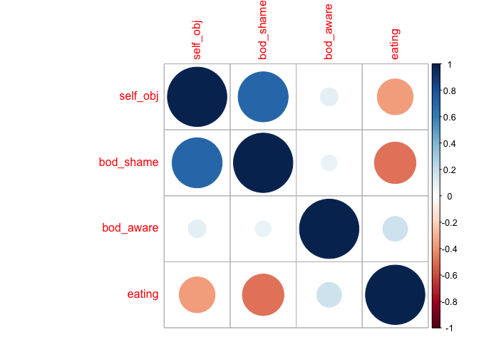

Final Project
================
Roxanne Felig
4/16/2021

## Final Project Introduction

This project explores the relationship between self-objectification (the
extent to which an individual takes an observer’s perspective of their
own body), body awareness (awareness and ability to recognize internal
bodily states), and intuitive eating (an eating style based on
physiological hunger and satiety cues). Previous research has found
relationships between self-objectification and body awareness,
self-objectification and intuitive eating, and body awareness and
intuitive eating, but to my knowledge no research explores the
relationship between the three constructs.

I have collected correlational data from both undergraduates in the SONA
participant pool which will test a mediational model, whereby
self-objectification reduces intuitive eating, mediated by reduced body
awareness. For this project, I will be cleaning the data set, reverse
scoring items, creating summary scores, and will begin to explore the
data.

## Data Cleaning

First order of business is to rename variables so that I can easily use
them. The self-objectification variables are named appropriately (e.g.,
SO1-SO14), but the other variable names are not intuitively named.The
re-coding scheme will be as follows:

Q18-Q25 are the body shame items and will be re-named BS1-BS8. BS 5 and
7 will then be reverse-scored before computing average scores.

Q27\_1 through Q27\_19 **with the exception of Q27\_11 which is an
attention check** will be re-coded as BAQ1-BAQ18 (measure of body
awareness). Items will be reverse coded and sub-scale averages as well
as grand average will be computed.

Q28\_1 through Q28\_24 **with the exception of Q28\_13 which is an
attention check** will be coded as eat\_1-eat\_23 (measure of intuitive
eating). Reverse coded items will be scored and an average score will be
computed.

Q34 will become age

Q36-sex (coded as 1=female, 2=male, 3= neither describes me)

Q38-gender (coded as 1=woman, 2=,man, 3=trans-woman, 4= trans-man, 5=nb,
6= self-describe, 7= prefer not to say)

Q48- race.

Using setnames, I will recode the body shame and body awareness items
first. Below is the corresponding code.

``` r
setnames(ie.data, old = c('Q18','Q19','Q20', 'Q21', 'Q22', 'Q23', 'Q24', 'Q25', 'Q27_1','Q27_2','Q27_3', 'Q27_4', 'Q27_5', 'Q27_6','Q27_7', 'Q27_8', 'Q27_9', 'Q27_10', 'Q27_11', 'Q27_12','Q27_13', 'Q27_14', 'Q27_15', 'Q27_16', 'Q27_17', 'Q27_18', 'Q27_19'), 
         new =c('BS1','BS2','BS3', 'BS4','BS5', 'BS6', 'BS7', 'BS8','BAQ1','BAQ2','BAQ3', 'BAQ4','BAQ5', 'BAQ6', 'BAQ7', 'BAQ8', 'BAQ9','BAQ10', 'Attn_check2', 'BAQ11', 'BAQ12', 'BAQ13', 'BAQ14', 'BAQ15','BAQ16', 'BAQ17', 'BAQ18'))
```

Next, I am re-naming the intuitive eating items.

``` r
setnames(ie.data, old = c('Q28_1','Q28_2','Q28_3','Q28_4','Q28_5','Q28_6','Q28_7','Q28_8',
'Q28_9', 'Q28_10','Q28_11','Q28_12','Q28_14','Q28_15','Q28_16','Q28_17','Q28_18','Q28_19',
'Q28_20','Q28_21','Q28_22','Q28_23','Q28_24'), 
         new =c('eat_1','eat_2','eat_3','eat_4','eat_5','eat_6','eat_7','eat_8','eat_9','eat_10','eat_11','eat_12','eat_13','eat_14','eat_15', 'eat_16', 'eat_17','eat_18','eat_19','eat_20','eat_21','eat_22','eat_23'))
```

Lastly, I am re-naming the demographic variables that will be most
important for my analyses.

``` r
setnames(ie.data, old = c('Q34','Q36','Q38','Q48'),
         new =c('age','sex','gender','race'))
```

Now I am creating two sets of reverse scored items, grouped by whether
or not they are on a scale of 1-5 or 1-7. After grouping them, I created
a new data frame including the reverse scored items.

``` r
reversed1<- c("BS5","BS7","BAQ10")
reversed2<-c("eat_1","eat_2","eat_3", "eat_7","eat_8","eat_9","eat_10")

ie_reverse<-ie.data %>%
  mutate(
    across(all_of(reversed1),
           ~ recode(.x, "7" = 1, "6" = 2, "5" = 3, "4" = 4, "3" = 5,"2"= 6, "1" = 7),
           .names = "{.col}r")
  ) %>%
  mutate(
    across(all_of(reversed2),
           ~ recode(.x, "5" = 1, "4" = 2, "3" = 3, "2" = 4, "1" = 5),
           .names = "{.col}r")
  )
```

Using the relocate function, I am moving all of the attention check
variables to the ends of the data set so that I can more easily
summarize across variables.

``` r
ie_clean<-ie_reverse %>% 
  relocate(Attn1, .after="Q54") %>% 
  relocate(Attn_check2, .after="Attn1") %>% 
  relocate(Q28_13, .after= "Attn_check2") 
```

While I was able to use c\_across to quickly compute a mean score of
self-objectification, I realized that in the previous step, the newly
reverse coded items were also placed at the end of the data set, making
it challenging to use c\_across to create average scores.

``` r
ie_full<-ie_clean %>%
  rowwise() %>% 
  mutate(
    .id=Q54,
    self_obj=mean(c_across(SO1:SO14), na.rm=TRUE),
    bod_shame=mean(c(BS1, BS2,BS3,BS4,BS5r,BS6, BS7r,BS8), na.rm = TRUE), 
    bod_aware=mean(c(BAQ1,BAQ2,BAQ3,BAQ4,BAQ5,BAQ6,BAQ7,BAQ8,BAQ9,BAQ10r,
    BAQ11,BAQ12,BAQ13,BAQ14,BAQ15,BAQ16,BAQ17,BAQ18),na.rm = TRUE),
    eating=mean(c(eat_1r,eat_2r,eat_3r,eat_4,eat_5,eat_6,eat_7r,eat_8r,eat_9r,
    eat_10r, eat_11,eat_12, eat_13, eat_14, eat_15, eat_16, eat_17, eat_18, eat_19,
    eat_20, eat_21,eat_22, eat_23),na.rm = TRUE),
    .before = everything()
  )
```

## Data Exploring

Now that I have my average scores of interest, I am creating a subset of
data using the select function to simplify my data set. I am plotting
each variable to see how the distributions look.

<!-- --><!-- --><!-- --><!-- --><!-- -->

The individual plots are easier to interpret than the side-by-side,
given that the side-by-side puts them all on a scale of 1-7 when some
are scored from 1-5. Body awareness and intuitive eating appear to be
normally distributed, with self-objectification and body shame looking
less normal, but not horribly skewed.

## Correlations

Now using my subsetted data, I am going to look at the correlations of
all variables of interest.

    ##           self_obj bod_shame bod_aware eating
    ## self_obj      1.00      0.71      0.09  -0.36
    ## bod_shame     0.71      1.00      0.07  -0.49
    ## bod_aware     0.09      0.07      1.00   0.17
    ## eating       -0.36     -0.49      0.17   1.00
    ## 
    ## n
    ##           self_obj bod_shame bod_aware eating
    ## self_obj       420       420       418    416
    ## bod_shame      420       420       418    416
    ## bod_aware      418       418       418    416
    ## eating         416       416       416    416
    ## 
    ## P
    ##           self_obj bod_shame bod_aware eating
    ## self_obj           0.0000    0.0654    0.0000
    ## bod_shame 0.0000             0.1434    0.0000
    ## bod_aware 0.0654   0.1434              0.0004
    ## eating    0.0000   0.0000    0.0004

<!-- -->

Here we see the correlation coefficients, followed by the number of
observations, and then the p values. Surprisingly, and contrary to my
hypothesis, body awareness is not significantly correlated with
self-objectification or body shame. However, these correlations are
using the entire sample of participants, with no filters or screening.

To explore how men and women differ, I need to identify my variable of
‘gender’ as a factor and label the levels.

Now I’m going to only filter women who passed all three attention
checks, and repeat the correlation analysis.

    ##           self_obj bod_shame bod_aware eating
    ## self_obj      1.00      0.71      0.06  -0.44
    ## bod_shame     0.71      1.00      0.03  -0.54
    ## bod_aware     0.06      0.03      1.00   0.20
    ## eating       -0.44     -0.54      0.20   1.00
    ## 
    ## n= 262 
    ## 
    ## 
    ## P
    ##           self_obj bod_shame bod_aware eating
    ## self_obj           0.0000    0.3272    0.0000
    ## bod_shame 0.0000             0.6821    0.0000
    ## bod_aware 0.3272   0.6821              0.0012
    ## eating    0.0000   0.0000    0.0012

<!-- -->

Well, this is surprising. In a sample of 262 women, body awareness is
not significantly correlated with self-objectification or body shame.
Self-objectification is negatively correlated with intuitive eating, as
expected, and body awareness and intuitive eating are positively
correlated, as expected.

Let’s so how the men’s data look.

    ##           self_obj bod_shame bod_aware eating
    ## self_obj      1.00      0.68      0.09  -0.34
    ## bod_shame     0.68      1.00      0.18  -0.40
    ## bod_aware     0.09      0.18      1.00   0.07
    ## eating       -0.34     -0.40      0.07   1.00
    ## 
    ## n= 103 
    ## 
    ## 
    ## P
    ##           self_obj bod_shame bod_aware eating
    ## self_obj           0.0000    0.3533    0.0004
    ## bod_shame 0.0000             0.0654    0.0000
    ## bod_aware 0.3533   0.0654              0.4922
    ## eating    0.0004   0.0000    0.4922

<!-- -->

Here we see a similar pattern whereby body awareness is not
significantly correlated with either self-objectification or intuitive
eating.

## Conclusion

Contrary to previous findings, I found no support for a relationship
between self-reported level of body awareness and self-objectification.
As such, I don’t believe my mediation model will work. This finding is
surprising given the existing research demonstrating reduces body
awareness as a consequence of self-objectification, but it’s possible
that this construct is difficult to self-report.
