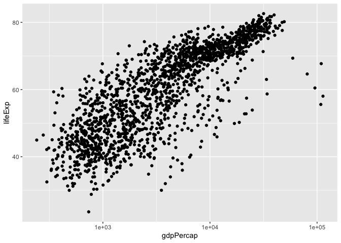
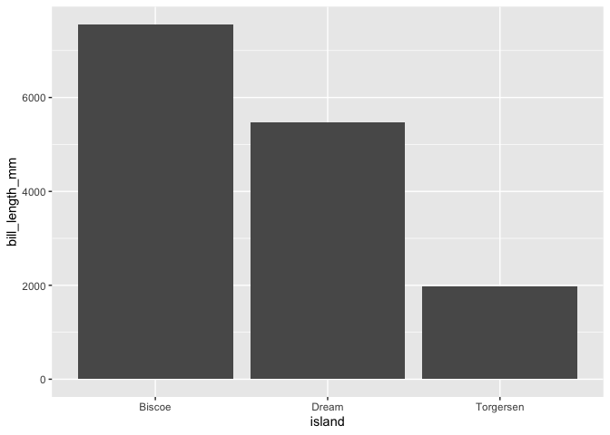

knitted hw2
================
Roxanne Felig
2/8/2021

## Assignment 02: Explore gapminder and use dplyr

``` r
# load your packages here:
library(gapminder)
library(tidyverse)
```

    ## ── Attaching packages ─────────────────────────────────────── tidyverse 1.3.0 ──

    ## ✓ ggplot2 3.3.3     ✓ purrr   0.3.4
    ## ✓ tibble  3.0.5     ✓ dplyr   1.0.3
    ## ✓ tidyr   1.1.2     ✓ stringr 1.4.0
    ## ✓ readr   1.4.0     ✓ forcats 0.5.0

    ## ── Conflicts ────────────────────────────────────────── tidyverse_conflicts() ──
    ## x dplyr::filter() masks stats::filter()
    ## x dplyr::lag()    masks stats::lag()

``` r
library(dplyr)
```

### 1.1 Use filter() to subset the gapminder data to three countries of your choice in the 1970’s.

``` r
gapminder %>%
  filter(country %in% c("Argentina","Chile","Germany") & year>1969 & year<1980)
```

    ## # A tibble: 6 x 6
    ##   country   continent  year lifeExp      pop gdpPercap
    ##   <fct>     <fct>     <int>   <dbl>    <int>     <dbl>
    ## 1 Argentina Americas   1972    67.1 24779799     9443.
    ## 2 Argentina Americas   1977    68.5 26983828    10079.
    ## 3 Chile     Americas   1972    63.4  9717524     5494.
    ## 4 Chile     Americas   1977    67.1 10599793     4757.
    ## 5 Germany   Europe     1972    71   78717088    18016.
    ## 6 Germany   Europe     1977    72.5 78160773    20513.

\#\#\#1.2 Use the pipe operator %&gt;% to select “country” and
“gdpPercap” from your filtered dataset in 1.1.

``` r
gapminder %>%
  filter(country %in% c("Argentina","Chile","Germany") & year>1969 & year<1980) %>% 
  select(country,gdpPercap)
```

    ## # A tibble: 6 x 2
    ##   country   gdpPercap
    ##   <fct>         <dbl>
    ## 1 Argentina     9443.
    ## 2 Argentina    10079.
    ## 3 Chile         5494.
    ## 4 Chile         4757.
    ## 5 Germany      18016.
    ## 6 Germany      20513.

\#\#\#1.3 Make a new variable in gapminder for the change in life
expectancy from the previous measurement. Filter this table to show all
of the entries that have experienced a drop in life expectancy. Hint:
you might find the lag() or diff() functions useful.

``` r
gapminder %>%
  group_by(country) %>% 
  mutate(lifeExp_change=lifeExp-lag(lifeExp)) %>% 
  filter(lifeExp_change<0)
```

    ## # A tibble: 102 x 7
    ## # Groups:   country [52]
    ##    country  continent  year lifeExp     pop gdpPercap lifeExp_change
    ##    <fct>    <fct>     <int>   <dbl>   <int>     <dbl>          <dbl>
    ##  1 Albania  Europe     1992    71.6 3326498     2497.         -0.419
    ##  2 Angola   Africa     1987    39.9 7874230     2430.         -0.036
    ##  3 Benin    Africa     2002    54.4 7026113     1373.         -0.371
    ##  4 Botswana Africa     1992    62.7 1342614     7954.         -0.877
    ##  5 Botswana Africa     1997    52.6 1536536     8647.        -10.2  
    ##  6 Botswana Africa     2002    46.6 1630347    11004.         -5.92 
    ##  7 Bulgaria Europe     1977    70.8 8797022     7612.         -0.09 
    ##  8 Bulgaria Europe     1992    71.2 8658506     6303.         -0.15 
    ##  9 Bulgaria Europe     1997    70.3 8066057     5970.         -0.87 
    ## 10 Burundi  Africa     1992    44.7 5809236      632.         -3.48 
    ## # … with 92 more rows

\#\#\#1.4 Filter gapminder so that it shows the max GDP per capita
experienced by each country. Hint: you might find the max() function
useful helpful

``` r
gapminder %>%
  group_by(country) %>% 
  summarize(maxgdp=max(gdpPercap))
```

    ## # A tibble: 142 x 2
    ##    country     maxgdp
    ##  * <fct>        <dbl>
    ##  1 Afghanistan   978.
    ##  2 Albania      5937.
    ##  3 Algeria      6223.
    ##  4 Angola       5523.
    ##  5 Argentina   12779.
    ##  6 Australia   34435.
    ##  7 Austria     36126.
    ##  8 Bahrain     29796.
    ##  9 Bangladesh   1391.
    ## 10 Belgium     33693.
    ## # … with 132 more rows

### 1.5 Produce a scatterplot of Canada’s life expectancy vs. GDP per capita using ggplot2, without defining a new variable. That is, after filtering the gapminder data set, pipe it directly into the ggplot() function. In your plot, put GDP per capita on a log scale.

``` r
gapminder %>%
  select(gdpPercap,lifeExp) %>% 
  ggplot(aes(x=gdpPercap,y=lifeExp)) +geom_point() + scale_x_log10()
```

<!-- -->

\#\#Use palmerpenguins::penguins or another dataset of your choice.
(Check out a dataset from the datasets R package if you want!)

\#\#\#2.1 Pick two quantitative variables to explore. Make a summary
table of descriptive statistics for these variables using summarize().
Include whatever staistics you feel appropriate (mean, median sd, range,
etc.). Make a scatterplot of these variables using ggplot().

**when i tried to pipe in the graph, it said it couldn’t find the
variables**

``` r
palmerpenguins::penguins %>% 
  select(bill_length_mm, flipper_length_mm) %>% 
  summarize(
    mean_bill=mean(bill_length_mm, na.rm=TRUE),
    sd_bill=sd(bill_length_mm, na.rm=TRUE),
    mean_flip=mean(flipper_length_mm, na.rm=TRUE),
    sd_flip=sd(flipper_length_mm, na.rm=TRUE))
```

    ## # A tibble: 1 x 4
    ##   mean_bill sd_bill mean_flip sd_flip
    ##       <dbl>   <dbl>     <dbl>   <dbl>
    ## 1      43.9    5.46      201.    14.1

``` r
palmerpenguins::penguins %>% 
  ggplot(aes(x=bill_length_mm,y=flipper_length_mm)) +geom_point()
```

    ## Warning: Removed 2 rows containing missing values (geom_point).

<!-- -->

\#\#\#2.2 Pick one categorical variable and one quantitative variable to
explore. Make a summary table giving the sample size (hint: n()) and
descriptive statistics for the quantitative variable by group. Make one
or more useful plots to visualize these variables.

``` r
str(palmerpenguins::penguins)
```

    ## tibble [344 × 8] (S3: tbl_df/tbl/data.frame)
    ##  $ species          : Factor w/ 3 levels "Adelie","Chinstrap",..: 1 1 1 1 1 1 1 1 1 1 ...
    ##  $ island           : Factor w/ 3 levels "Biscoe","Dream",..: 3 3 3 3 3 3 3 3 3 3 ...
    ##  $ bill_length_mm   : num [1:344] 39.1 39.5 40.3 NA 36.7 39.3 38.9 39.2 34.1 42 ...
    ##  $ bill_depth_mm    : num [1:344] 18.7 17.4 18 NA 19.3 20.6 17.8 19.6 18.1 20.2 ...
    ##  $ flipper_length_mm: int [1:344] 181 186 195 NA 193 190 181 195 193 190 ...
    ##  $ body_mass_g      : int [1:344] 3750 3800 3250 NA 3450 3650 3625 4675 3475 4250 ...
    ##  $ sex              : Factor w/ 2 levels "female","male": 2 1 1 NA 1 2 1 2 NA NA ...
    ##  $ year             : int [1:344] 2007 2007 2007 2007 2007 2007 2007 2007 2007 2007 ...

``` r
palmerpenguins::penguins %>% 
  select(island, bill_length_mm) %>% 
  summarize(n=n(),
            mean_bill=mean(bill_length_mm, na.rm=TRUE),
            sd_bill=sd(bill_length_mm, na.rm=TRUE)) 
```

    ## # A tibble: 1 x 3
    ##       n mean_bill sd_bill
    ##   <int>     <dbl>   <dbl>
    ## 1   344      43.9    5.46

``` r
palmerpenguins::penguins %>% 
  select(island, bill_length_mm) %>% 
  ggplot(aes(x=island,y=bill_length_mm)) +
  geom_bar(stat='identity')
```

    ## Warning: Removed 2 rows containing missing values (position_stack).

<!-- -->

``` r
filter(gapminder, country %in% c("Rwanda", "Afghanistan"))
```

    ## # A tibble: 24 x 6
    ##    country     continent  year lifeExp      pop gdpPercap
    ##    <fct>       <fct>     <int>   <dbl>    <int>     <dbl>
    ##  1 Afghanistan Asia       1952    28.8  8425333      779.
    ##  2 Afghanistan Asia       1957    30.3  9240934      821.
    ##  3 Afghanistan Asia       1962    32.0 10267083      853.
    ##  4 Afghanistan Asia       1967    34.0 11537966      836.
    ##  5 Afghanistan Asia       1972    36.1 13079460      740.
    ##  6 Afghanistan Asia       1977    38.4 14880372      786.
    ##  7 Afghanistan Asia       1982    39.9 12881816      978.
    ##  8 Afghanistan Asia       1987    40.8 13867957      852.
    ##  9 Afghanistan Asia       1992    41.7 16317921      649.
    ## 10 Afghanistan Asia       1997    41.8 22227415      635.
    ## # … with 14 more rows

``` r
##the first code skipped over several years by searching for anywhere where Rwanda was listed first, followed by Afghanistan.
```
