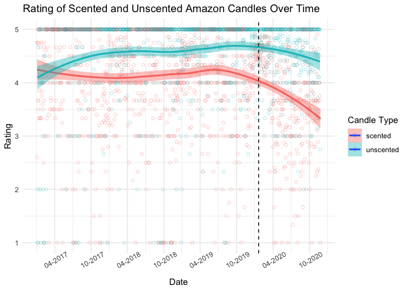
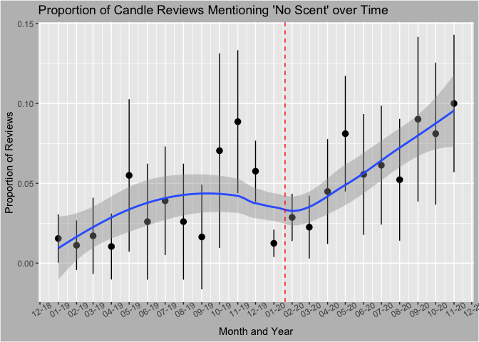

Covid-19 and Candles
================
Roxanne Felig
3/22/2021

This assignment explores the impact of Covid-19 on scented candle
ratings. As we now know, loss of taste and smell is a prevalent symptom
associated with Covid-19. However, early on in the pandemic it was not
recognized as an official symptom. By exploring the online ratings and
reviews of scented candles as a metric of loss of smell, we can
investigate the Covid-19 timeline in the United States.

*The data*

The two datasets used in this assignment contain information for the Top
3 selling scented and unscented candles sold on Amazon. Each dataset
includes a numeric ID variable corresponding to one of the top 3
candles, the date of the review, and the rating on a 1 to 5 scale. The
scented candle data includes the review text.

*Average daily ratings for scented and unscented candles*

First, we are going to investigate the average daily ratings for scented
and unscented candles. In these figures, the date is shown on the x-axis
in 6-month increments, with a vertical line indicating January 01, 2020.
That way, we can easily visualize the change in candle ratings after the
onset of Covid-19. The figures show trend lines for each of the top
three candles, with one plot showing the top three scented candles, and
the other showing the top three unscented candles.

As we can see in these graphs, ratings of the three top unscented
candles have remained relatively consistent (and high) since 2017.
However, beginning toward the end of 2019, ratings for the three top
scented candles significantly declined. The vertical line indicates the
beginning of 2020, and as we can see, ratings for all three of the most
popular candles plummeted.

``` r
plot1 <- 
  scented %>% 
  filter(Date > as.Date("2017-01-01")) %>% 
  group_by(Date) %>% 
  mutate(mean_rating= mean(Rating)) %>% 
  ggplot(
    aes(x=as.Date(Date), y=mean_rating,
        shape=as.factor(CandleID),
        color=as.factor(CandleID),
        fill= as.factor(CandleID))) + 
         geom_point(alpha=.3, shape=1) +
      scale_x_date(date_breaks = "6 months", date_labels = "%m-%Y") +
  geom_smooth(method = "loess") +
  geom_vline(xintercept = as.numeric(as.Date("2020-01-20")), linetype="dashed")+
  theme_minimal()+
  scale_fill_discrete(name="Candle Type")+
  guides(color=FALSE)+
  scale_y_continuous(name="Rating")+
  xlab("Date") + 
  theme(axis.text.x = element_text(angle = 30))+
  ggtitle("Rating of Scented Amazon Candles Over Time")

plot2 <-
  unscented %>% 
  filter(Date > as.Date("2017-01-01")) %>% 
  group_by(Date) %>% 
  mutate(mean_rating= mean(Rating)) %>% 
  ggplot(
    aes(x=as.Date(Date), y=mean_rating,
        shape=as.factor(CandleID),
        color=as.factor(CandleID),
        fill= as.factor(CandleID))) + 
         geom_point(alpha=.3, shape=1) +
      scale_x_date(date_breaks = "6 months", date_labels = "%m-%Y") +
  geom_smooth(method = "loess") +
  geom_vline(xintercept = as.numeric(as.Date("2020-01-20")), linetype="dashed")+
  theme_minimal()+
  scale_fill_discrete(name="Candle Type")+
  guides(color=FALSE)+
  scale_y_continuous(name="Rating")+
  xlab("Date") + 
  theme(axis.text.x = element_text(angle = 30))+
  ggtitle("Rating of Unscented Amazon Candles Over Time")

grid.arrange(plot1, plot2, ncol=2)
```

    ## `geom_smooth()` using formula 'y ~ x'
    ## `geom_smooth()` using formula 'y ~ x'

<!-- -->

*Combined plot*

Now, the two datasets have been combined into one, so that the trend
lines for scented and unscented candles can be plotted on the same
graph.

``` r
candles_full <- bind_rows(
    scented = scented, 
    unscented = unscented, 
    .id = "Scented"
)
```

``` r
candles_full %>% 
  filter(Date > as.Date("2017-01-01")) %>% 
  group_by(Date, Scented) %>% 
  summarize(mu = mean(Rating)) %>% 
  ggplot(
    aes(x=as.Date(Date), y=mu,
        shape=as.factor(Scented),
        color=as.factor(Scented),
        fill= as.factor(Scented))) + 
         geom_point(alpha=.3, shape=1) +
      scale_x_date(date_breaks = "6 months", date_labels = "%m-%Y") +
  geom_smooth(method = "loess") +
  geom_vline(xintercept = as.numeric(as.Date("2020-01-20")), linetype="dashed")+
  theme_minimal()+
  scale_fill_discrete(name="Candle Type")+
  guides(color=FALSE)+
  scale_y_continuous(name="Rating")+
  xlab("Date") + 
  theme(axis.text.x = element_text(angle = 30))+
  ggtitle("Rating of Scented and Unscented Amazon Candles Over Time")
```

    ## `summarise()` has grouped output by 'Date'. You can override using the `.groups` argument.

    ## `geom_smooth()` using formula 'y ~ x'

<!-- -->

I find this combined figure easier to interpret than the side by side
figures because we can very explicitly see how drastically the ratings
in scented candles dropped compared to unscented. Further, I think it’s
simpler to look at two trend lines rather than the six that are
presented in the two side-by-side plots. One pro of the side-by-sides is
that we can see the trend lines for each of the top three candles, which
is very useful information, but the combined plot very clearly shows us
what we are interested in.

*Proportion of reviews mentioning “no scent”*

Use the scented candles database and make one more plot showing:

1.  For **each month in 2019 and 2020**,
2.  On the x axis, month and year
3.  On the y axis, the **proportion of reviews** mentioning that the
    scented candles have no smell - Include both the mean (proportion)
    and a 95% confidence interval
4.  Color the symbols by year (2019 vs 2020)

As before, make the

Hints:

1.  To round each date to its months, use: -
    `mutate(month = lubridate::floor_date(Date, "month"))`
2.  To compute a mean and confidence interval for a variable on a plot,
    similar to a box plot, use: -
    `stat_summary(aes(y = noscent), fun.data = mean_cl_normal)`
3.  Use the function below to detect “no smell”-related text in the
    `Review` column.

``` r
scented$ScentReview <- str_no_scent(scented$Review)
scented$Date<-as.Date(scented$Date)

new_data<-scented %>% 
  filter(Date >= as.Date("2019-01-01") & CandleID <= 3) %>% 
  mutate(month = lubridate::floor_date(Date, "month")) %>% 
  mutate(Review = str_no_scent(Review)) 

ggplot(new_data, aes(x = month, y = ScentReview)) +
  stat_summary(aes(y = ScentReview),fun.data = mean_cl_normal) +
  scale_x_date(date_breaks = "month", date_labels = "%m-%y") +
  guides(shape = FALSE) +
  scale_y_continuous(name = "Proportion of Reviews") +
  xlab("Month and Year")+
  geom_smooth(method = "loess") +
  theme(axis.text.x = element_text(angle = 30))+
  geom_vline(xintercept = as.numeric(as.Date("2020-01-20")),
             colour = "red",
             linetype = 2
             ) +
  ggtitle("Proportion of Candle Reviews Mentioning 'No Scent' over Time") +
  theme(plot.background = element_rect(fill = "gray"), 
        axis.text.x = element_text(size = 9)
        )
```

    ## `geom_smooth()` using formula 'y ~ x'

<!-- -->

Over time, the proportion of reviews mentioning no scent or lack of
scent increased, with the slope really changing at the beginning of
2020, as indicated with the red dashed line.
